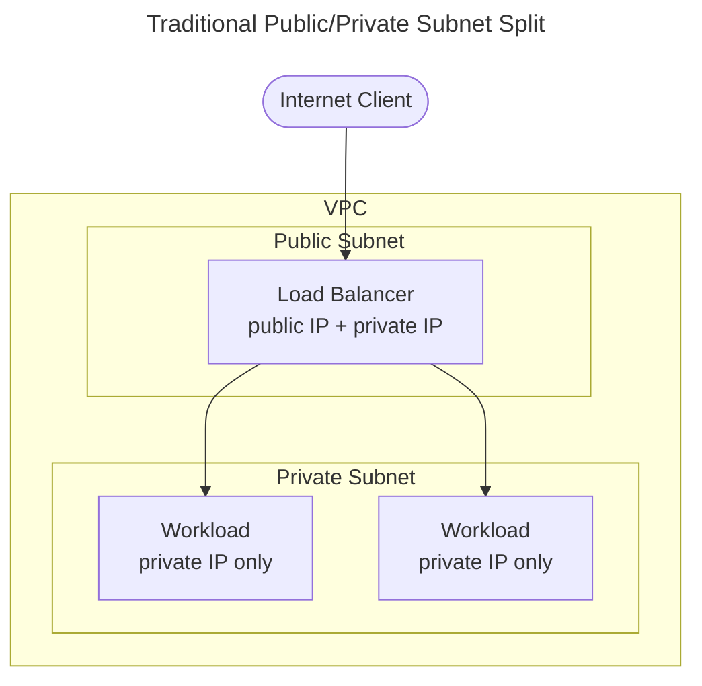
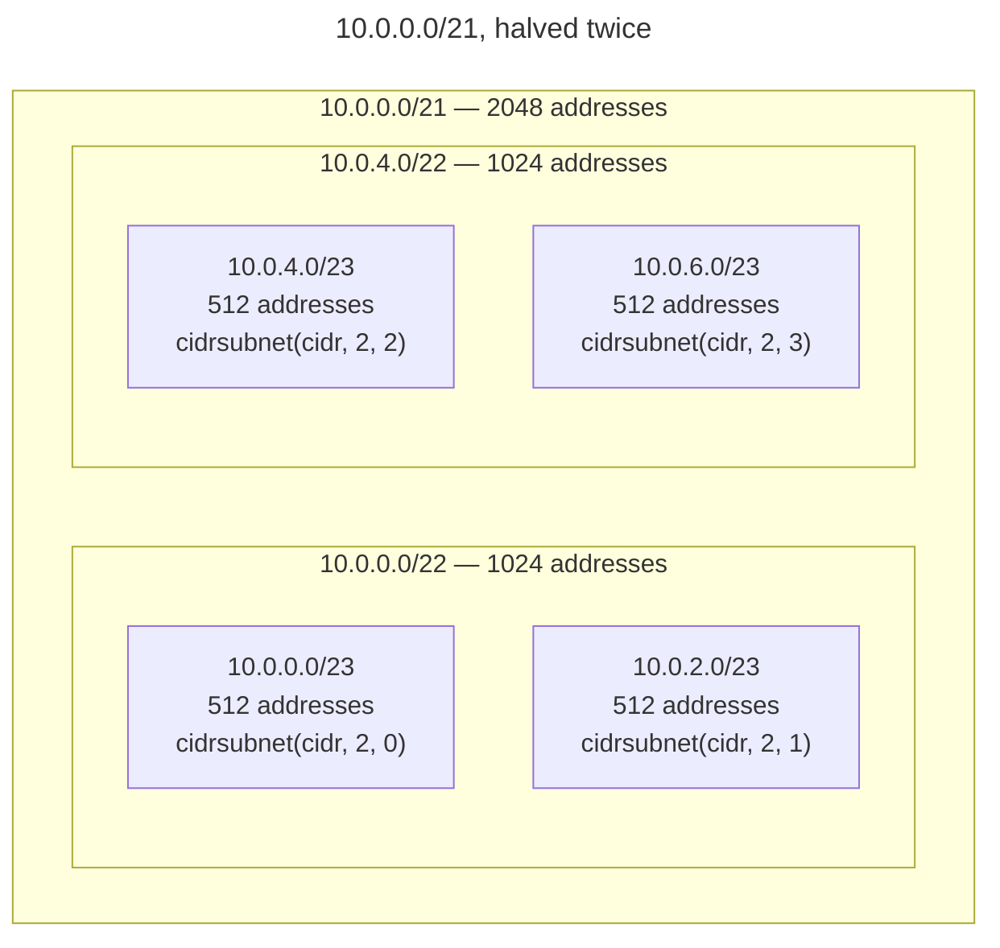

## The problem

Subnetting is a pain. Developers don't want to do it because they're afraid
they'll make a mistake. Network engineers don't want developers to do it either,
for the same reason.

Say you have a VPC with a 21-bit mask. That gives you about 2000 IP addresses to
split up however you see fit. How do you decide where they go? Usually the
answer is a meeting, a spreadsheet, and a bunch of hand-typed string literals in
a `.tfvars` file. Sooner or later somebody mistypes an octet, two subnets end up
overlapping, and everyone remembers why they didn't like doing this in the first
place.

There's a second problem too. Developers who aren't comfortable with subnetting
tend not to ask for what they actually need. Instead, they ask for more than
they could ever use, just to be safe. So every VPC becomes a /16. Every subnet
becomes a /24. The organization's address space fills up with space nobody is
using, and the network team spends its time rejecting requests instead of
reviewing them.

Part of a platform engineer's job is to bridge the gap between what a developer
knows operationally and what a network engineer has learned the hard way. In
this post, I'll show you how to apply that idea to subnetting by making the
subnet layout a _derived_ property of the VPC, instead of a pile of
hand-maintained strings.

### Subnets in AWS and their use cases

AWS really only has two kinds of subnets: public and private. The difference
between them comes down to what kind of IP addresses can be assigned to network
interfaces in each one.

- Interfaces created in **public subnets** can be assigned a private IP address
  or a public IP address, depending on what you need.
- Interfaces created in **private subnets** can only be assigned a private IP
  address.

In general, you want to launch your workloads in private subnets. If those
workloads need to be reachable from the internet, don't expose them directly.
Instead, put a load balancer in a public subnet in front of them. The load
balancer acts as your access control and gives you a stable DNS target to point
at.



> [!NOTE]
> In the past, a common pattern was to launch a single EC2 instance in a public
> subnet, called a bastion host, whose only job was to give administrators a
> controlled way into the VPC. These days,
> [SSM Session Manager](https://docs.aws.amazon.com/systems-manager/latest/userguide/session-manager-working-with-sessions-start.html#sessions-remote-port-forwarding)
> does the same job without needing a publicly reachable instance at all.

In practice, private subnets end up being pretty diverse depending on how
they're used. It helps to think about them in terms of route configuration and
group membership. Here's a table that breaks that down:

| Private Subnet Subtype | Internet Egress? | Subtype Criteria                                                     |
| ---------------------: | :--------------: | :------------------------------------------------------------------- |
|        General-Purpose |       Yes        | The subnet has a route to a NAT gateway and matches no other subtype |
|               Isolated |        No        | The subnet has no route to a NAT gateway                             |
|               Database |    Sometimes     | The subnet is part of a database subnet group                        |
|            Elasticache |    Sometimes     | The subnet is part of an elasticache subnet group                    |
|               Redshift |    Sometimes     | The subnet is part of a redshift workgroup                           |
|                    VPN |    Sometimes     | The subnet is configured as a VPN target network                     |

Nothing stops you from using a private subnet that's assigned to a database
subnet group as a general-purpose private subnet too. The distinction here is
purely logical, and it's there to help you organize things, not to enforce
anything.

> [!NOTE]
> If you use the excellent
> [terraform-aws-modules/vpc](https://registry.terraform.io/modules/terraform-aws-modules/vpc/aws/latest)
> module (and I do), you'll see these no-NAT-gateway subnets called **intra**
> subnets instead of isolated subnets. They're the same thing. I'll use that
> name for the rest of this post, since the code examples are built around that
> module.

## A quick CIDR refresher

Before we get into slicing anything, let's make sure we're on the same page
about how CIDR blocks work. An IPv4 address is 32 bits long. A CIDR block like
`10.0.0.0/21` tells you that the first 21 bits are fixed, and the remaining 11
bits are yours to use however you'd like. Eleven free bits gives you 2¹¹, or
2048, addresses.

Here's the part that matters for slicing: every bit you borrow from those free
bits cuts your available space in half. If you extend a /21 to a /22, you end up
with two blocks of 1024 addresses each. Extend it to a /24 and you get eight
blocks of 256. That's really all there is to it. Everything else in this post is
just deciding how to divide those halvings up between the tiers of your VPC.

| Prefix | Total Addresses | Usable in AWS |
| -----: | --------------: | ------------: |
|    /21 |            2048 |          2043 |
|    /22 |            1024 |          1019 |
|    /23 |             512 |           507 |
|    /24 |             256 |           251 |
|    /25 |             128 |           123 |
|    /26 |              64 |            59 |
|    /27 |              32 |            27 |
|    /28 |              16 |            11 |

> [!IMPORTANT]
> AWS reserves five addresses in every subnet: the network address, the VPC
> router, the DNS resolver, one address reserved for future use, and the
> broadcast address. That's why the usable column above is always five lower
> than the total. In a /23 that's barely noticeable, but in a /28 those five
> addresses are a quarter of your entire subnet, so keep that in mind as your
> slices get smaller.

## The two functions that do the work

Terraform ships two built-in functions that turn subnetting from manual string
manipulation into simple arithmetic:
[`cidrsubnet`](https://developer.hashicorp.com/terraform/language/functions/cidrsubnet)
and
[`cidrsubnets`](https://developer.hashicorp.com/terraform/language/functions/cidrsubnets).

### `cidrsubnet(prefix, newbits, netnum)`

`cidrsubnet` carves a single child block out of a parent block. It takes three
arguments:

- `prefix` is the block you're carving up.
- `newbits` is how many bits to add to the prefix. Every bit you add cuts the
  block in half again, so this controls how many slices you end up with.
- `netnum` is which of those slices you want back, counting up from 0.

The easiest way to get a feel for it is to run the same starting block,
`10.0.0.0/21`, through a few different values and see what comes out.

**Split it in half (`newbits = 1`):** one new bit gives you two possible slices,
`0` and `1`.

```hcl
cidrsubnet("10.0.0.0/21", 1, 0) # => "10.0.0.0/22"  (1st half, 1024 addresses)
cidrsubnet("10.0.0.0/21", 1, 1) # => "10.0.4.0/22"  (2nd half, 1024 addresses)
```

**Split it into quarters (`newbits = 2`):** two new bits gives you four possible
slices, `0` through `3`.

```hcl
cidrsubnet("10.0.0.0/21", 2, 0) # => "10.0.0.0/23"  (1st quarter, 512 addresses)
cidrsubnet("10.0.0.0/21", 2, 1) # => "10.0.2.0/23"  (2nd quarter, 512 addresses)
cidrsubnet("10.0.0.0/21", 2, 2) # => "10.0.4.0/23"  (3rd quarter, 512 addresses)
cidrsubnet("10.0.0.0/21", 2, 3) # => "10.0.6.0/23"  (4th quarter, 512 addresses)
```

**Split it into eighths (`newbits = 3`):** three new bits gives you eight
possible slices, `0` through `7`.

```hcl
cidrsubnet("10.0.0.0/21", 3, 4) # => "10.0.4.0/24"  (5th eighth, 256 addresses)
```

Two things fall out of these examples:

1. `newbits` decides the _size_ of the slices. The more bits you add, the
   smaller and more numerous the slices get: a /21 becomes /22s for halves, /23s
   for quarters, and /24s for eighths.
2. `netnum` decides _which_ slice you get. It never changes the size, only the
   position.

It helps to picture this as containment rather than as a tree of separate
networks, because that's really what it is. A `/23` isn't a different network
sitting next to a `/22`, it's a piece carved out of it. Halving `10.0.0.0/21`
twice looks like this:



> [!TIP]
> If you want to poke at a layout more interactively than a static diagram
> allows,
> [davidc's subnet calculator](http://www.davidc.net/sites/default/subnets/subnets.html)
> lets you split a block down visually and watch it redraw as you go. It's a
> good way to build intuition before you commit a set of ratios to a `locals`
> block.

So where does the actual address come from? `netnum` gets written straight into
the bits you just added. In this example, `newbits = 3` claims the three free
bits at the end of the third octet, so that's the only part of the address that
ever changes. Here's the exact call next to the octet it produces:

| Call                              | Result      | Octet 3 in binary                                                                   |
| :-------------------------------- | :---------- | :---------------------------------------------------------------------------------- |
| _(the parent block itself)_       | 10.0.0.0/21 | `00000xxx` — 5 bits fixed, 3 free                                                   |
| `cidrsubnet("10.0.0.0/21", 3, 4)` | 10.0.4.0/24 | `00000100` — netnum 4 (`100`) filled in and replacing the `xxx` from the bare block |

`netnum = 4` is `100` in binary, and those three digits are exactly what get
stamped into the three free bits, nothing more. Everything else in the address,
the first two octets and the fourth octet, is untouched. That's really the whole
function: pick how many bits to add, then pick which combination of those bits
you want, and the call itself tells you both.

Because it's just binary math under the hood, slices from different calls can
never overlap by accident. The first half of the VPC (`newbits = 1,
netnum = 0`)
covers exactly the same address space as the first four eighths
(`newbits = 3, netnum = 0` through `3`), since all of them start with a `0` bit.
So if you hand that first half to one tier, eighths 4 through 7 are guaranteed
to be free, because their leading bit is `1`. There's no way to create a
collision here, because nobody ever typed an address by hand. You can check the
arithmetic yourself, too: a half is 1024 addresses, and four eighths at 256
addresses each also add up to 1024, so the pieces really do tile the space
exactly, with nothing left over and nothing double-booked.

|                 Slice | Expression               | Block       | Addresses |
| --------------------: | :----------------------- | :---------- | --------: |
| first half (netnum 0) | `cidrsubnet(cidr, 1, 0)` | 10.0.0.0/22 |      1024 |
|              eighth 4 | `cidrsubnet(cidr, 3, 4)` | 10.0.4.0/24 |       256 |
|              eighth 5 | `cidrsubnet(cidr, 3, 5)` | 10.0.5.0/24 |       256 |
|              eighth 6 | `cidrsubnet(cidr, 3, 6)` | 10.0.6.0/24 |       256 |
|              eighth 7 | `cidrsubnet(cidr, 3, 7)` | 10.0.7.0/24 |       256 |

1024 + 256 × 4 = 2048, the entire /21. Nothing overlaps, and nothing is left
unaccounted for.

### `cidrsubnets(prefix, newbits, newbits, ...)`

The plural version of this function allocates several consecutive child blocks
in one call, one for each `newbits` argument you pass it, and returns them as a
list. The simplest and most useful case is splitting a block cleanly in half:

```hcl
cidrsubnets("10.0.0.0/22", 1, 1) # => ["10.0.0.0/23", "10.0.2.0/23"]
```

That gives us two one-bit slices, splitting the block evenly in two. We'll use
this to split each tier of our VPC across two availability zones, and since it
returns a list, we can pass the result straight into the subnet arguments that
VPC modules expect.

> [!TIP]
> You don't need a real configuration to experiment with these functions. Run
> `terraform console` in any initialized working directory, even an empty one,
> and you can call `cidrsubnet` and `cidrsubnets` directly and see the result
> immediately. It's a much faster feedback loop than editing a `.tf` file and
> running `plan` just to check your math:
>
> ```sh
> $ terraform console
> > cidrsubnet("10.0.0.0/21", 3, 4)
> "10.0.4.0/24"
> > cidrsubnets("10.0.0.0/22", 1, 1)
> [
>   "10.0.0.0/23",
>   "10.0.2.0/23",
> ]
> > exit
> ```
>
> This is a good way to sanity-check a layout before you commit it to code, or
> to build up the intuition for how `newbits` and `netnum` interact before you
> trust yourself to write it from memory.

## The pattern: one input, a whole network out

Here's the whole pattern put together. Only one variable needs to cross the
module boundary:

```hcl
variable "vpc_cidr_block" {
  description = "the CIDR block for the VPC"
  type        = string
}
```

Then a `locals` block derives every subnet in the VPC from that one value. The
first part decides the VPC's shape:

```hcl
locals {
  cidr_blocks = {
    vpc         = var.vpc_cidr_block
    private     = cidrsubnet(var.vpc_cidr_block, 1, 0) # half
    public      = cidrsubnet(var.vpc_cidr_block, 3, 4) # eighth
    database    = cidrsubnet(var.vpc_cidr_block, 3, 5) # eighth
    elasticache = cidrsubnet(var.vpc_cidr_block, 3, 6) # eighth
    intra       = cidrsubnet(var.vpc_cidr_block, 3, 7) # eighth
  }

  # vpc = { ... } continues below
}
```

`cidr_blocks` decides the ratio each tier gets. Private workloads get half of
the whole VPC, and the other four tiers each get an eighth. Half plus four
eighths adds up to the whole VPC, so the address space gets used up completely,
without any overlap.

With the tiers sized, the rest of the block splits each one across two
availability zones:

```hcl
locals {
  # cidr_blocks = { ... } from above

  vpc = {
    private_subnets     = cidrsubnets(local.cidr_blocks.private, 1, 1)
    public_subnets      = cidrsubnets(local.cidr_blocks.public, 1, 1)
    database_subnets    = cidrsubnets(local.cidr_blocks.database, 1, 1)
    elasticache_subnets = cidrsubnets(local.cidr_blocks.elasticache, 1, 1)
    intra_subnets       = cidrsubnets(local.cidr_blocks.intra, 1, 1)
  }
}
```

`vpc` takes each of those tiers and splits it across two availability zones.

Once we have those two maps built, feeding the result into the VPC module is
completely mechanical:

```hcl
module "vpc" {
  source  = "terraform-aws-modules/vpc/aws"
  version = "~> 6.0"

  name = local.name
  cidr = local.cidr_blocks.vpc
  azs  = slice(data.aws_availability_zones.available.names, 0, 2)

  private_subnets     = local.vpc.private_subnets
  public_subnets      = local.vpc.public_subnets
  database_subnets    = local.vpc.database_subnets
  elasticache_subnets = local.vpc.elasticache_subnets
  intra_subnets       = local.vpc.intra_subnets

  enable_nat_gateway = true
  single_nat_gateway = true
}
```

If we pass in `vpc_cidr_block = "10.0.0.0/21"`, here's what we end up with:

|        Tier | Block       | AZ a        | AZ b          | Usable per AZ |
| ----------: | :---------- | :---------- | :------------ | ------------: |
|     private | 10.0.0.0/22 | 10.0.0.0/23 | 10.0.2.0/23   |           507 |
|      public | 10.0.4.0/24 | 10.0.4.0/25 | 10.0.4.128/25 |           123 |
|    database | 10.0.5.0/24 | 10.0.5.0/25 | 10.0.5.128/25 |           123 |
| elasticache | 10.0.6.0/24 | 10.0.6.0/25 | 10.0.6.128/25 |           123 |
|       intra | 10.0.7.0/24 | 10.0.7.0/25 | 10.0.7.128/25 |           123 |

Ten subnets, and not a single string literal typed by hand. Here's the part I
like best about this pattern: if you pass in `10.1.16.0/22` instead, the same
module produces the exact same shape, just at half the size. The layout is a
policy decision baked into the module. The CIDR block is just an input. When a
team asks the network folks for address space, all they need to ask for is one
reviewable number, something like "we'd like a /21 for staging," instead of
handing over a spreadsheet of subnets that someone has to check line by line.
And whatever size they get approved for gets used completely, so there's no
reason left to ask for more than they need. Sizing down doesn't cost the
developer anything.

## Guidelines for slicing

The ratios I used above aren't a law of nature. They're just one reasonable
answer to the question "who needs the addresses most?" for one particular kind
of stack. Here's how I'd think through designing your own:

1. **Think in ratios, not counts.** Instead of thinking "the app tier needs 200
   IPs," think "the app tier needs half the VPC." Ratios still make sense if the
   VPC size changes later. Fixed counts don't.
2. **Pick a base slice size.** Decide on the smallest unit you're going to work
   in. Eighths work well for most layouts. Then hand out multiples of that unit:
   a half is four eighths, a quarter is two eighths, and so on. Sticking to one
   denominator makes it easy to check your math by hand.
3. **Give the biggest slice to whatever scales horizontally.** That's usually
   the tier whose IP usage grows with load, not with how the architecture is
   designed.
4. **Leave a spare slice if you can.** An unused eighth is cheap insurance
   against a tier you didn't think of ahead of time.

Let's apply these guidelines to two common types of stacks.

### Layout 1: Kubernetes-heavy (the one above)

If you're running EKS with the default VPC CNI, every pod gets assigned a real
VPC IP address. Not just the nodes, the pods themselves. A cluster with just a
dozen nodes can burn through hundreds of addresses quickly, while your load
balancers, databases, and cache nodes only need a handful each. That's why
private gets half the VPC in this layout, and it's usually still the first tier
to feel tight:

```hcl
private     = cidrsubnet(var.vpc_cidr_block, 1, 0) # pods eat IPs; give generously
public      = cidrsubnet(var.vpc_cidr_block, 3, 4) # load balancers + NAT
database    = cidrsubnet(var.vpc_cidr_block, 3, 5) # RDS subnet group
elasticache = cidrsubnet(var.vpc_cidr_block, 3, 6) # cache subnet group
intra       = cidrsubnet(var.vpc_cidr_block, 3, 7) # EKS control plane ENIs, VPC endpoints
```

The intra slice works well for the EKS control plane's cross-account network
interfaces, and for VPC interface endpoints, since those need to live inside the
VPC but never need to reach the internet.

### Layout 2: Classic three-tier web app

In this layout, we put the ALB in a public subnet, the app servers in a private
subnet, and RDS in a database subnet. Since there's no pod networking involved,
the app tier's IP usage is limited by how many instances you're running, but
it's still the only tier that autoscales, so it still gets half the VPC. The
database tier gets a quarter, to leave room for replicas and blue/green
deployments. Public stays small, and we set aside the last eighth:

```hcl
private  = cidrsubnet(var.vpc_cidr_block, 1, 0) # half:    app tier
database = cidrsubnet(var.vpc_cidr_block, 2, 2) # quarter: RDS + replicas
public   = cidrsubnet(var.vpc_cidr_block, 3, 6) # eighth:  ALB + NAT
# eighth 7 (10.0.7.0/24 on a /21) intentionally unallocated
```

If you check the tiling in eighths, the half covers eighths 0 through 3, the
quarter (`netnum = 2` of a two-bit split, or `10` in binary) covers eighths 4
and 5, public gets eighth 6, and eighth 7 is left unused. On a `/21`, that
breaks down like this:

|     Tier | Expression                             | Block       |
| -------: | :------------------------------------- | :---------- |
|  private | `cidrsubnet(var.vpc_cidr_block, 1, 0)` | 10.0.0.0/22 |
| database | `cidrsubnet(var.vpc_cidr_block, 2, 2)` | 10.0.4.0/23 |
|   public | `cidrsubnet(var.vpc_cidr_block, 3, 6)` | 10.0.6.0/24 |
|    spare | --                                     | 10.0.7.0/24 |

Same functions, same single input, different set of ratios. The value of this
pattern isn't in the specific ratios I've chosen here. It's that the ratios all
live in one place, decided by whoever on the team actually understands the
workload, and every environment inherits them automatically.

#### This layout can usually be a lot smaller than the EKS layout

It's worth calling out how much smaller a VPC this layout actually needs, even
though it's using the exact same functions and the exact same eighths-based
ratios as the EKS layout above. The EKS layout gets sized for pods. This one
gets sized for EC2 instances and an RDS cluster, and those are much cheaper on
IP addresses. A three-tier app with a few dozen instances behind an ALB isn't
going to come anywhere close to using up even a small private subnet, let alone
half a /21.

So how small can we go? There's still a hard floor here, but it doesn't come
from how many IPs the app tier needs. It comes from the ALB itself: each of its
subnets has to be at least a /27 with 8 free addresses, and since the public
tier is an eighth of the VPC split again across two availability zones, that
works out to the VPC prefix plus four bits. A /27 minus four bits puts the floor
at a /23, the same floor the EKS layout runs into. The difference is that the
EKS layout usually has to size well above that floor to leave room for pod
growth, while the three-tier layout can just sit at the floor comfortably.
Here's the same layout, same ratios, run against `10.0.0.0/23` instead of a /21:

|     Tier | Block         | AZ a          | AZ b          |    Usable per AZ |
| -------: | :------------ | :------------ | :------------ | ---------------: |
|  private | 10.0.0.0/24   | 10.0.0.0/25   | 10.0.0.128/25 |              123 |
| database | 10.0.1.0/25   | 10.0.1.0/26   | 10.0.1.64/26  |               59 |
|   public | 10.0.1.128/26 | 10.0.1.128/27 | 10.0.1.160/27 |               27 |
|    spare | 10.0.1.192/26 | --            | --            | 64 (unallocated) |

That's a /23, 512 addresses total, a quarter the size of the /21 the EKS layout
typically needs, and public still clears the ALB's /27 minimum with room to
spare. 123 usable addresses per AZ is already more than most three-tier app
tiers will ever run at once, and 59 per AZ is plenty for RDS and its replicas.
If your team is running a straightforward three-tier app without any pod
networking involved, there's rarely a reason to ask the network team for
anything bigger than this.

## Gotchas worth knowing before you commit

This pattern trades some flexibility for consistency, and that trade comes with
a few real costs. It's worth understanding these up front, both so you don't get
surprised later and so the network engineers reviewing your design take you
seriously.

### Changing the layout means recreating subnets

Subnet CIDRs can't be changed in AWS once they're created. If you resize the VPC
or change the ratios later, terraform will plan to destroy and recreate every
subnet that moved, and everything running in those subnets goes down with them.
Pick your ratios before you put any real workloads in the VPC. This is a
measure-twice situation, not something you want to tune once you're already in
production.

### There's a floor on VPC size

The bit math adds up quickly. An eighth split across two availability zones
means your VPC prefix plus four bits. If you hand this layout a /24 VPC, your
public subnets come out as /28s, which is only 11 usable addresses, below what
some AWS services will even accept (more on that in the next section). With the
EKS-heavy layout above, a /23 is the smallest VPC size that still works, and a
/21 or /22 gives you more comfortable room. It's worth adding a validation block
so this gets caught before anyone runs `terraform apply`:

```hcl
variable "vpc_cidr_block" {
  description = "the CIDR block for the VPC"
  type        = string

  validation {
    condition     = tonumber(split("/", var.vpc_cidr_block)[1]) <= 23
    error_message = "VPC CIDR must be /23 or larger for the subnet layout to produce usable slices."
  }
}
```

### AWS services have their own per-subnet requirements

There are a few minimums buried in AWS's documentation that only become a
problem once your slices get small:

- An **Application Load Balancer** requires each of its subnets to be at least a
  /27 and have at least
  [8 free IP addresses](https://docs.aws.amazon.com/elasticloadbalancing/latest/application/application-load-balancers.html#subnets-load-balancer),
  which it uses as headroom when scaling out. If you don't give it enough room,
  you'll start seeing 5xx errors during scaling events, which can be a
  frustrating thing to debug.
- **EKS** needs at least
  [six available IPs](https://docs.aws.amazon.com/eks/latest/userguide/network-reqs.html)
  in the subnets you give to the control plane (AWS recommends a /28 or larger),
  and it uses extra network interfaces during cluster upgrades.
- And remember, AWS's five reserved addresses per subnet come off the top of all
  of this.

None of this matters much in a /23. All of it matters in a /28. The validation
block from the previous section is really just a way of making sure your slices
stay big enough that these requirements never come up.

### Two availability zones is usually enough

Every example in this post splits each tier across two availability zones, and
that's on purpose, not just because two is convenient for binary halving. In my
experience, going beyond two AZs doesn't actually buy you much more
availability. AWS builds each region assuming a single AZ can go down on its
own, and that's the failure mode two AZs protects you against. But if you've
lost two AZs at the same time, you're not really looking at an "AZ outage"
anymore. At that point, something is almost certainly wrong at the regional
level, and a third AZ sitting next to the other two isn't independent enough to
save you from that. It's exposed to a lot of the same shared infrastructure, the
same regional control plane, the same network backbone. So a third AZ mostly
adds cost and complexity without actually changing your odds of surviving the
event that would take out a second one in the first place.

There are real exceptions to this. Some workloads specifically want an odd
number of nodes for quorum, things like etcd or ZooKeeper clusters, where three
AZs map cleanly onto three-way consensus. And if you're operating under a
compliance requirement that mandates a specific number of availability zones,
that requirement wins regardless of what the math says. But if neither of those
applies to you, I'd default to two and put the address space and operational
overhead you'd have spent on a third AZ somewhere it'll actually move the
needle.

If you do have a specific reason to move to three AZs, the mechanics are worth
knowing. `cidrsubnets(block, 1, 1)` assumes two availability zones. To move to
three, you have two options: use `cidrsubnets(block, 2, 2, 2)`, which wastes a
quarter of each tier in an unused fourth slot, or redesign your ratios around an
availability zone count that isn't a power of two. There's no clean way around
this, since binary halving doesn't divide evenly by three. Decide on your
availability zone count with the same care you give the ratios, since changing
it later means the same destroy-and-recreate process.

### The ratios are a starting point, not a rule

An IP-hungry EKS platform and a small three-container API shouldn't use the same
layout. What makes this pattern valuable is that the layout lives in one place
and is derived from a single input, not that any particular set of ratios is
correct for every team. If a team genuinely needs different numbers, give their
module its own locals. What you should never go back to is typing subnet strings
by hand.

## Where IPAM fits in

Everything so far solves subnetting within a single VPC. One level up from that
is the question of which VPC gets which CIDR block in the first place, and
that's a job for
[Amazon VPC IPAM](https://docs.aws.amazon.com/vpc/latest/ipam/what-it-is-ipam.html),
AWS's managed address planning tool. It lets you define pools per region or
business unit and automatically tracks conflicts across your whole organization.

These two things work well together, because this pattern only ever needed one
input, and producing that input is exactly what IPAM is built to do:

```hcl
resource "aws_vpc_ipam_pool_cidr_allocation" "this" {
  ipam_pool_id   = var.ipam_pool_id
  netmask_length = 21
}

locals {
  vpc_cidr_block = aws_vpc_ipam_pool_cidr_allocation.this.cidr
  # ...same slicing locals as before, fed from the allocation
}
```

With this in place, nobody has to type a CIDR block by hand at any layer. IPAM
hands the VPC its block from a governed pool, and the module slices up whatever
it receives. The network team manages the pools, the platform module manages the
ratios, and developers don't have to manage either one. That's the division of
labor working the way it should.

If you don't need something as heavyweight as IPAM, it's also worth knowing
about the
[hashicorp/subnets/cidr](https://registry.terraform.io/modules/hashicorp/subnets/cidr/latest)
module, which wraps this same arithmetic in a more declarative interface. I
prefer using the raw functions myself, since five lines of locals with no
dependencies is hard to beat, but the module is a solid choice if the
`newbits`/`netnum` math makes your team nervous.

## Conclusion

Subnetting by hand is a particularly bad kind of manual work. It's rare enough
that nobody stays sharp at it, important enough that mistakes cause real
problems, and tedious enough that nobody double-checks the spreadsheet
carefully. Encoding the layout as ratios in a `locals` block turns all of that
into arithmetic that a computer can do correctly every time. Developers stop
over-asking for address space because sizing down doesn't cost them anything.
Network engineers stop having to audit subnet tables by hand, since there's only
one number left to review. And the address space, no matter what size it ends up
being, gets used completely, without any overlaps or waste.

One input in, a whole network out. Thanks for reading! If you have any questions
or comments, feel free to reach out to me at
[zach@zmc.dev](mailto:zach@zmc.dev). Thank you!

## Resources

- [`cidrsubnet` function documentation](https://developer.hashicorp.com/terraform/language/functions/cidrsubnet)
- [`cidrsubnets` function documentation](https://developer.hashicorp.com/terraform/language/functions/cidrsubnets)
- [terraform-aws-modules/vpc](https://registry.terraform.io/modules/terraform-aws-modules/vpc/aws/latest)
- [ALB subnet requirements](https://docs.aws.amazon.com/elasticloadbalancing/latest/application/application-load-balancers.html#subnets-load-balancer)
- [EKS VPC and subnet requirements](https://docs.aws.amazon.com/eks/latest/userguide/network-reqs.html)
- [Amazon VPC IPAM](https://docs.aws.amazon.com/vpc/latest/ipam/what-it-is-ipam.html)
- [hashicorp/subnets/cidr module](https://registry.terraform.io/modules/hashicorp/subnets/cidr/latest)
