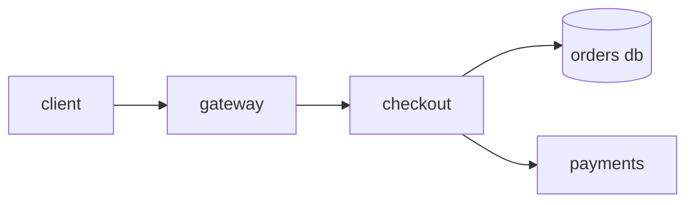

# Charting Unseen Systems

A field guide to observability in production

---
layout: section
title: Orientation
coord: TABVLA PRIMA · ORIENTATIO
---

# Orientation

---

# The Instrument Panel

Every expedition begins with the same three questions:

<v-clicks>

- **What is the system doing?** — metrics, the steady tick of the chronometer
- **Why is it doing that?** — traces, the plotted course of a single request
- **What did it say at the time?** — logs, the captain's journal

</v-clicks>

<v-click>

*Correlate all three, and an incident stops being weather — and becomes navigation.*

</v-click>

<!--
Land each question before revealing the next — the fourth line is the thesis
of the whole talk.
-->

---
layout: two-cols
heading: Signals, Compared
---

## Metrics

- Cheap to store, cheap to query
- Pre-aggregated — you chose the questions in advance
- The first thing to look at, the last thing to trust alone

::right::

## Traces

- Expensive, sampled, glorious
- One request's full itinerary across services
- The only signal that answers *where the time went*

---

# And the Logs?

The third signal deserves its own row in the chart — every signal trades cost for candor:

| SIGNAL | COST | ANSWERS | FAILURE MODE |
| --- | --- | --- | --- |
| Metrics | Cheap | *That* something broke | You only see questions you pre-asked |
| Traces | Sampled | *Where* the time went | The interesting request wasn't sampled |
| Logs | Verbose | *Why* it happened | Needle, meet haystack |

---
layout: statement
---

Dashboards tell you **that** it broke.
Traces tell you **where**.
Logs tell you **why**.

---
layout: section
title: The Working Code
coord: TABVLA SECVNDA · INSTRVMENTA
---

# The Working Code

---
layout: code
heading: telemetry.ts
---

```ts {4,9-12}
import { trace, context } from '@opentelemetry/api'

export async function withSpan<T>(name: string, fn: () => Promise<T>): Promise<T> {
  const tracer = trace.getTracer('zmc-expedition')
  return tracer.startActiveSpan(name, async (span) => {
    try {
      return await fn()
    } catch (err) {
      span.recordException(err as Error)
      span.setStatus({ code: 2, message: (err as Error).message })
      throw err
    } finally {
      span.end()
    }
  })
}
```

---
layout: code-right
heading: Reading the Chart
---

The span wrapper earns its keep in three places:

- The **active span** propagates through async context — children attach themselves
- Exceptions are recorded *and* re-thrown; telemetry never swallows errors
- `finally` guarantees the span ends even on the unhappy path

::code::

```ts
const order = await withSpan('order', async () => {
  const cart = await withSpan('cart', loadCart)
  const paid = await withSpan('pay',
    () => charge(cart))
  return withSpan('save',
    () => persist(cart, paid))
})
```

---
layout: code-left
heading: The Go Side
---

Same instrument, idiomatic `error` plumbing:

- `defer span.End()` is the `finally`
- Context threading is explicit
- One shared convention across both services

::code::

```go
func WithSpan(
	ctx context.Context,
	name string,
	fn func(context.Context) error,
) error {
	ctx, span := tracer.Start(ctx, name)
	defer span.End()

	if err := fn(ctx); err != nil {
		span.RecordError(err)
		span.SetStatus(codes.Error, err.Error())
		return err
	}
	return nil
}
```

<!--
Point out that the Go and TS wrappers are interchangeable in shape — teams
can share the convention across services. (Slide notes must be the LAST
comment in the slide, after any ::slot:: content, to reach presenter view.)
-->

---
layout: compare
heading: One Query, Two Eras
leftLabel: ANTE · N+1
rightLabel: POST · BATCHED
---

::left::

```ts
for (const id of orderIds) {
  const order = await db.orders.findUnique({
    where: { id },
  })
  results.push(order)
}
```

::right::

```ts
const results = await db.orders.findMany({
  where: {
    id: { in: orderIds },
  },
})
```

---
layout: terminal
heading: EXPEDITION LOG · PROD-EAST
---

```bash
$ kubectl get pods -n checkout | grep -v Running
checkout-api-7d4b9c-x2vlp   0/1   CrashLoopBackOff   14   42m

$ kubectl logs checkout-api-7d4b9c-x2vlp --previous | tail -3
FATAL: connection pool exhausted (max=10, waiting=147)
  at PoolClient.acquire (pg-pool/index.js:45:11)
  at OrderRepo.findMany (src/repo/orders.ts:88:20)
```

---
layout: fact
caption: p99 checkout latency, before and after the batched query shipped
---

14.2s → 240ms

---
layout: quote
author: JOHANNES KEPLER · ASTRONOMIA NOVA · 1609
---

I much prefer the sharpest criticism of a single intelligent man
to the thoughtless approval of the masses.

---
layout: image-right
heading: The Star Chart Itself
image: https://images.unsplash.com/photo-1462331940025-496dfbfc7564?w=1200&q=80
caption: FIG. VII — THE FIELD OF STUDY
---

Instrumentation is cartography:

- The territory is the running system
- The map is what your telemetry lets you see
- An incident is discovering where the map is **wrong**

---

# The Territory, Mapped

Every signal in this talk flows through the same four leagues of terrain —
instrument each hop, and Tabvla II's expedition-log incident takes minutes
to localize, not hours:



<!--
Trace the incident backwards along the arrows: pool exhaustion surfaced in
checkout, but the fix landed in the orders query.
-->

---
layout: full
---


<!-- smoked glass: pulls the photo toward the chart's midnight palette -->
<div style="position: absolute; inset: 0; background: linear-gradient(160deg, rgba(11, 14, 20, 0.5), rgba(19, 26, 42, 0.15) 55%, rgba(11, 14, 20, 0.55))"></div>

<div class="zmc-panel" style="position: absolute; left: 3rem; bottom: 3rem; max-width: 26rem; padding: 1.1rem 1.5rem">
  <span class="zmc-eyebrow">PLATE · CAELVM INCOGNITVM</span>
  <p style="margin: 0.4rem 0 0">An uninstrumented system is this sky —
  beautiful, and unreadable. Instrumentation is how you draw the chart.</p>
</div>

<!--
Beat of silence here. Then: "so let's draw yours." Advance to close.
-->

---
layout: end
author: ZACH CALLAHAN
coord: ZMC.DEV
---

# Gratias Vobis Ago

Questions, corrections, and better star charts welcome.
